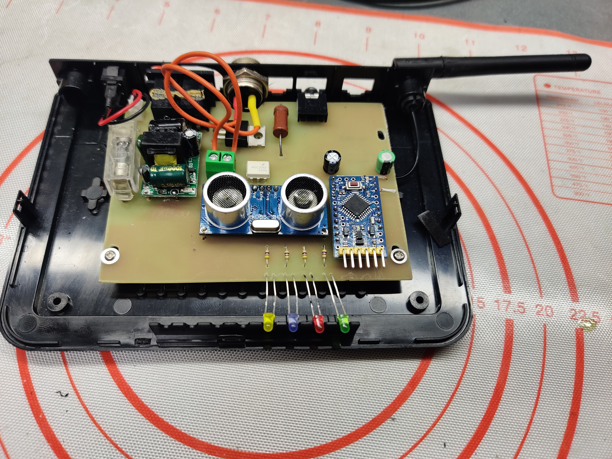

# Термостат электрического коврика для ног с сонаром и управлением из УД через MySensors
- Сонар как датчик присутствия ног
- Два режима поддержания температуры (выбираются автоматически)
    - Основной (при наличии ног) 
    - Дежурный (при отсутствии ног и сигнала из УД, что я дома)
- Температуры и таймауты для Сонара - задаются из УД, сохраняются в EEPROM
- Поддержание температуры только полной коммутацией нагревательного элемента (без фазоимпульсного регулирования и прочих ПИД), гистерезис так же задается из УД
- ОТА (MysBootloader 1.3)
  
## Реализация
Рабочее место у меня на отапливаемом балконе. Пол неотапливаемый (есть на то причины) бетон + плитка, сверху покрыт винтажной ковровой дорожкой. Все бы ничего - но ноги зимой замерзают даже в тапочках и шерстяных носках. Присмотрел, всем известно где, коврик с подогревом. 

Коврик не плохой, но управление у него "умное". Не буду расписывать, что в понимании китайского сумрачного гения "умное" управление, думаю пульт - сам за себя все расскажет. 

Вот наконец дошли руки переделать как надо с применением Arduino pro mini с загрузчиком MYSBootloader 1.3.0, радиомодуль NRF24L01 + PA + LNA в SMD исполнении, сонар HC-SR04, обратная связь по температуре DS18B20. Питание ACDC 5V 3.5W XL-007

### Принципиальная схема

### Внутренности
Запакованы в корпус старого роутера. У меня много чего в такие корпуса упаковано, т.к. по 50р/шт прихватил вязаночку по случаю.

### Результат

## Замечания к коду 
- MYSBootloader прошитый, таки дает возможность заливать прошивку и традиционно по UART, но прошивать/отлаживать так крайне не удобно: при каждой загрузке десятки секунд уходят на работу самого бутлоадера, до того как он передаст управление прошивке
- За весь код ни одного delay-я и wait-а не ~~пострадало~~ использовано. Все исключительно неблокирующее. 
- Из найденных библиотек HC-SR04 мне ни одна не понравилась, сделал свою с неблокирующим чтением (Sonar.*).
- Считаю, изящно сделал и не блокирующее чтение температуры с DS18B20 (еще изящнее сделать на аппаратном таймере, но лень)
- В связи с тем, что saveState/loadState в MySensors хранит только байтовые значения, по фен-шую использовал hwReadConfigBlock / hwWriteConfigBlock